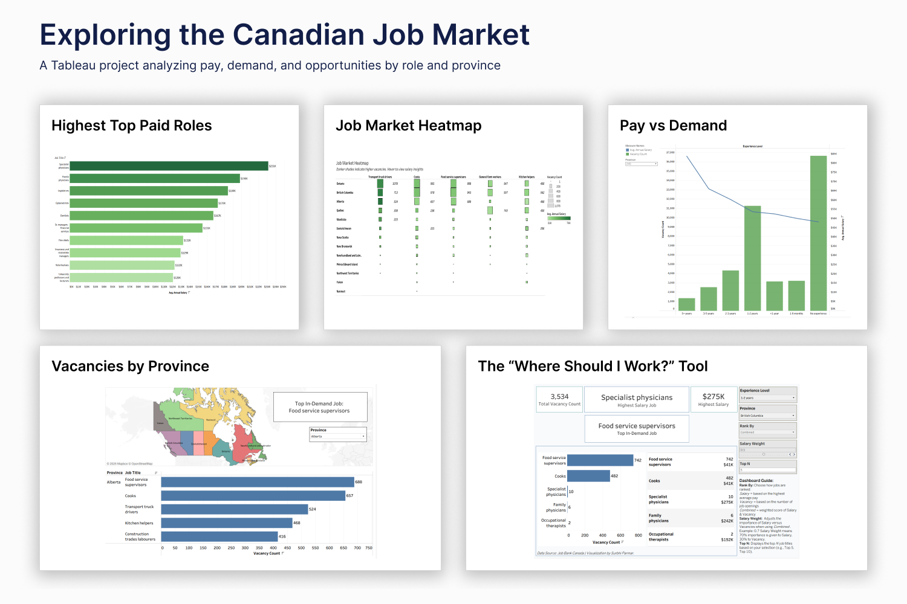

# Canadian Job Market Analysis - Tableau

> **Where should you work in Canada?**
> Most job seekers look at job boards and guess. This project removes the guesswork - using official Government of Canada data to answer which jobs pay the most, where vacancies are highest, and given your province and experience level, what you should actually apply for.

🔗 **[Explore the Live Interactive Dashboard on Tableau Public](https://public.tableau.com/app/profile/surbhi.parmar/viz/TheWhereShouldIWorkTool_17581909951970/PayvsDemandDashboard?publish=yes)**

🔗 **[View Vacancies by Province Dashboard](https://public.tableau.com/app/profile/surbhi.parmar/viz/TopJobsbyDemand_Provincewise/VacanciesbyProvinceandTopJobs)**

---

## The Bottom Line

Using the official Canadian Job Bank Dataset (July 2025), this project analyzes salary, vacancy, and experience data across all provinces. The result is a suite of interactive Tableau dashboards - including a career decision tool that gives any job seeker a ranked list of roles based on their own province, experience level, and priorities.

---

## Key Findings at a Glance

| Finding | Detail |
|---------|--------|
| **Top vacancy provinces** | Ontario (Transport truck drivers: 1,078) and BC (Cooks: 978) lead nationally |
| **Most consistent role nationally** | Cooks and Food service supervisors appear in top 5 across nearly every province |
| **Atlantic Canada** | Dominated by Fish and seafood plant workers - reflects coastal economy |
| **Salary vs demand crossover** | At 3–5 years experience, salary rises sharply while vacancies drop - the key inflection point |
| **Highest paying roles** | Specialist physicians ($231K), Family physicians ($198K), Optometrists ($172K) lead nationally |
| **Transport truck drivers** | High vacancy AND above-average salary - strongest combined opportunity in the dataset |
| **High demand ≠ high pay** | Cooks and Food service supervisors dominate vacancies but sit in the lower salary tier |

---

## Project Overview

The Canadian job market is not uniform - salaries, vacancies, and in-demand roles vary dramatically by province and experience level. A job seeker in Ontario faces a completely different landscape than one in Saskatchewan. This project answers four targeted questions:

1. Which roles pay the most - and where in Canada?
2. Which provinces have the highest number of vacancies right now?
3. How does salary change as experience level increases - and does demand follow the same curve?
4. Given all of the above, what job should a specific person actually apply for?

---

## Dataset

**Source:** [Government of Canada Job Bank](https://www.jobbank.gc.ca/) - Canada's official national job board
**Extract date:** July 2025

**Fields included:**
- Job Title, Province, Number of Vacancies
- Salary Range (Min/Max), Required Experience Level

The raw data required significant cleaning before visualization - salary fields contained nulls, experience levels were inconsistently formatted, and job titles had spelling variations that would have caused undercounting in aggregations.

---

## Tools Used

| Tool | Purpose |
|------|---------|
| **Microsoft Excel** | Data cleaning, salary calculations, experience level standardization |
| **Tableau Public** | All visualizations - dashboards, charts, interactive filters, parameters |

**Key Tableau Skills:** Calculated Fields | Parameters | Dual-Axis Charts | Dashboard Actions | Interactive Filters | Top N Parameters | KPI Cards

---

## Methodology

### 1. Data Cleaning in Excel

All cleaning was done in Excel before connecting to Tableau - to ensure every calculated field would produce accurate, trustworthy numbers.

| Step | What Was Done | Why It Matters |
|------|--------------|----------------|
| Removed irrelevant columns | Kept only Job Title, Province, Vacancies, Salary (Min/Max), Experience Level | Fewer columns = faster Tableau performance |
| Standardized job titles | Merged spelling variants and duplicates | Without this, vacancy counts per role would be silently undercounted |
| Handled salary nulls | Replaced blank salary fields with "Not Specified" (not zero) | Avoids pulling down average salary calculations with false zero values |
| Removed unrealistic salaries | Filtered out records below $15/hour (below minimum wage) | Removes data entry errors from averages |
| Built Average Salary column | Averaged Min and Max salary fields | Single comparable number per posting for Tableau calculations |
| Derived Annual Salary | Converted hourly/weekly/monthly to annual using SWITCH logic | Essential for cross-role salary comparison |
| Standardized Experience Level | Converted free-text to consistent ranges (e.g. "1-3 years") | Required for grouping and filtering in Tableau |

### 2. Visualization in Tableau

Five dashboards and charts built to answer the project's core questions - each designed around a specific decision, not just to display data.

---

#### Dashboard 1: "Where Should I Work" - Interactive Career Decision Tool

🔗 [Try it live on Tableau Public](https://public.tableau.com/app/profile/surbhi.parmar/viz/TheWhereShouldIWorkTool_17581909951970/PayvsDemandDashboard?publish=yes)

The centrepiece of this project. Users select:
- **Province** - filter to their location
- **Experience Level** - entry, mid, senior
- **Ranking Preference** - Salary or Vacancy priority
- **Top N** - how many results to display

KPI cards update instantly to show either the highest-paying role and its salary, or the most in-demand role and its vacancy count - depending on what the user prioritizes.

**Tableau techniques used:** Parameters, Calculated Fields, Dashboard Actions, Top N filtering, dynamic KPI cards.

---

#### Dashboard 2: Vacancies by Province & Job Role

🔗 [View on Tableau Public](https://public.tableau.com/app/profile/surbhi.parmar/viz/TopJobsbyDemand_Provincewise/VacanciesbyProvinceandTopJobs)

Interactive map and bar chart showing the top 5 in-demand jobs per province, with a KPI card surfacing the single most in-demand role instantly.

**Key findings:**
- Ontario: Transport truck drivers lead at 1,078 vacancies
- BC: Cooks lead at 978 vacancies
- Québec: General farm workers lead at 743 vacancies
- Atlantic Canada (NB, NS, PEI): Dominated by Fish and seafood plant workers - reflecting the coastal economy
- Cooks and Food service supervisors appear in the top 5 of almost every province - the most nationally consistent roles

---

#### Chart 3: Pay vs Demand - Dual-Axis Chart

Plots experience levels against both vacancy counts and average annual salary on dual axes.

**Key finding:** Entry-level roles have significantly more vacancies but lower pay. Senior roles pay more but have far fewer openings. The sharpest crossover - where demand drops and salary rises most steeply - occurs at the **3-5 year experience mark**, making that the most strategic point for upskilling investment.

---

#### Chart 4: Job Market Heatmap

Square size = vacancies, darker shade = higher salary across top roles and provinces.

**Key finding:** Transport truck drivers are the strongest combined opportunity - large squares AND darker shading in Ontario, BC, and Alberta. Cooks and Food service supervisors dominate in volume but are lighter in shade - high demand, lower pay. The salary range across all roles runs **$31K–$74K**, with darker squares concentrated in Transport and skilled trades.

---

#### Chart 5: Top 10 Salaries by Province

Ranks the top 10 highest-paying roles per province with a province filter for comparison.

**Key finding:** Healthcare dominates the salary rankings nationally:
- Specialist physicians: $231K
- Family physicians: $198K
- Optometrists: $172K
- Dentists: $167K
- Sr. managers, financial services: $155K (only non-healthcare role in the upper tier)

The gap between #1 ($231K) and #10 ($120K) is significant - credentials in medicine or finance yield dramatically different outcomes than high-vacancy roles.

---

## Key Insights & Business Impact

### For Job Seekers
Instead of guessing which jobs to apply for, a candidate can filter by their province and experience level and get a ranked list of roles - sorted by whatever they care about most, salary or demand. That's a tool, not a chart.

### For Employers
Salary benchmarking by province and role is immediately available. A hiring manager in BC can see how their offered salary compares to the provincial average for that role - and whether their vacancy count is typical or unusually high.

### For Policymakers
Labor market gaps - provinces where demand is high but qualified candidates are scarce - are visible in the heatmap and province dashboards. This kind of visibility supports targeted immigration, training, and education funding decisions.

---

## How to Use

**Option 1 - Live on Tableau Public (recommended):**
Click any of the Tableau Public links above. No installation required.

**Option 2 - Local:**
1. Download `Job_Market_Analysis.twbx`
2. Open in Tableau Desktop or Tableau Public (free)
3. Use province filter, experience level selector, and Top N parameter to explore

---

## Connect

**Portfolio:** [surbhiparmar01.github.io](https://surbhiparmar01.github.io)
**LinkedIn:** [linkedin.com/in/surbhiparmar](https://www.linkedin.com/in/surbhiparmar/)
**GitHub:** [github.com/SurbhiParmar01](https://github.com/SurbhiParmar01)
